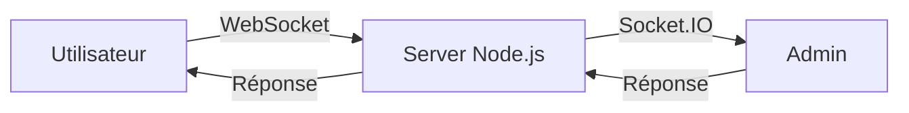

<div align="center">

# 🌫️ Brume

### Assistant IA simulé avec interface en temps réel

[](https://nodejs.org/)
[](https://expressjs.com/)
[](https://socket.io/)
[](LICENSE)

[Démo](#-démo) • [Installation](#-installation-rapide) • [Fonctionnalités](#-fonctionnalités) • [Documentation](#-documentation)

</div>

---

## 📖 Description

**Brume** est une application web interactive qui simule une intelligence artificielle conversationnelle. Les utilisateurs peuvent poser des questions anonymement et recevoir des réponses en temps réel, fournies discrètement par des administrateurs humains via une interface dédiée.

Ce projet éducatif démontre les concepts fondamentaux du développement web moderne : communication temps réel avec WebSocket, architecture client-serveur, et gestion d'états distribués.

### 🎯 Cas d'usage

- **Pédagogique** : Apprendre Node.js, Express et Socket.IO
- **Prototype** : Tester un concept de chat avec support humain déguisé
- **Démonstration** : Illustrer les interactions temps réel dans une application web

---

## ✨ Fonctionnalités

### 👤 Interface Utilisateur

- 🎨 Design moderne inspiré de ChatGPT (thème sombre)
- 💬 Chat en temps réel avec sessions anonymes
- ⏳ Animation de "réflexion" pendant l'attente
- 📱 Interface responsive et intuitive
- 🆔 Identifiant de session unique généré automatiquement

### 👨‍💼 Interface Administrateur

- 📋 Liste des sessions utilisateur actives
- 🔔 Notifications de nouveaux messages (badge "NEW")
- 💬 Vue complète de l'historique des conversations
- ⚡ Réponse en temps réel avec envoi par Enter
- 🎯 Interface multi-onglets pour gérer plusieurs utilisateurs

---

## 🚀 Installation Rapide

### Prérequis

- [Node.js](https://nodejs.org/) version 18 ou supérieure
- npm (inclus avec Node.js)

### Étapes d'installation

1. **Cloner le dépôt**
   ```bash
   git clone https://github.com/Stilmant/Brume.git
   cd Brume
   ```

2. **Installer les dépendances**
   ```bash
   npm install
   ```

3. **Lancer le serveur**
   ```bash
   node server.js
   ```

4. **Accéder à l'application**
   - Interface utilisateur : [http://localhost:3000/user.html](http://localhost:3000/user.html)
   - Interface admin : [http://localhost:3000/admin.html](http://localhost:3000/admin.html)

Le serveur démarre sur le port **3000** par défaut.

---

## 🎬 Démo

### Interface Utilisateur
L'utilisateur converse avec "Brume" via une interface moderne et épurée.

```
┌─────────────────────────────────────────┐
│  🌫️ Brume          Session: abc123def  │
├─────────────────────────────────────────┤
│                                         │
│  [V] Bonjour Brume !                   │
│                                         │
│      [B] Bonjour ! Comment puis-je     │
│          vous aider aujourd'hui ?       │
│                                         │
│  [V] Quelle est la météo ?             │
│                                         │
│      [B] ● ● ●  (réflexion...)         │
│                                         │
├─────────────────────────────────────────┤
│ Envoyez un message à Brume...  [Envoyer]│
└─────────────────────────────────────────┘
```

### Interface Administrateur
Les admins voient toutes les sessions et peuvent répondre instantanément.

```
┌──────────────┬────────────────────────────┐
│ 🌫️ Brume     │ Conversation: abc123def    │
│ [ADMIN]      │                            │
├──────────────┤  [U] Bonjour Brume !       │
│ Sessions     │                            │
│              │      [B] Bonjour ! Comment │
│ ● abc123def  │          puis-je vous...   │
│   NEW        │                            │
│   2 messages │  [U] Quelle est la météo ? │
│              │                            │
│ ○ xyz789abc  │                            │
│   1 message  │                            │
│              ├────────────────────────────┤
│              │ Réponse... 🔹 [Envoyer]   │
└──────────────┴────────────────────────────┘
```

---

## 🏗️ Architecture

### Technologies

| Technologie | Version | Rôle |
|------------|---------|------|
| **Node.js** | 20+ | Runtime JavaScript côté serveur |
| **Express** | 5.1 | Framework web minimaliste |
| **Socket.IO** | 4.8 | Communication bidirectionnelle temps réel |
| **UUID** | 13.0 | Génération d'identifiants uniques |

### Structure du projet

```
Brume/
├── public/
│   ├── user.html      # Interface utilisateur (chat)
│   └── admin.html     # Interface administrateur
├── server.js          # Serveur Node.js + Socket.IO
├── package.json       # Dépendances et configuration
└── README.md          # Documentation
```

### Flux de communication



1. L'utilisateur se connecte et reçoit un ID de session unique
2. Les messages sont transmis en temps réel via Socket.IO
3. L'admin reçoit une notification et peut répondre
4. La réponse est envoyée instantanément à l'utilisateur

---

## 📚 Documentation

### Fichiers principaux

#### `server.js`
Serveur Express avec gestion Socket.IO pour :
- Servir les fichiers statiques (`public/`)
- Gérer les connexions utilisateur/admin
- Router les messages entre sessions
- Stocker l'historique en mémoire (Map)

#### `public/user.html`
Interface utilisateur avec :
- Design moderne (thème sombre)
- Gestion des messages et avatars
- Animation de saisie (typing indicator)
- Auto-scroll et responsive design

#### `public/admin.html`
Panel d'administration avec :
- Liste dynamique des sessions
- Badges de notification
- Vue détaillée des conversations
- Champ de réponse avec raccourcis clavier

### Configuration

Le serveur écoute sur le port `3000`. Pour changer le port :

```javascript
// Dans server.js, ligne finale
httpServer.listen(3000, () => {
  console.log("http://localhost:3000");
});
```

---

## 🔮 Améliorations Futures

- [ ] 💾 Persistance des données avec SQLite/MongoDB
- [ ] 🔐 Authentification admin avec mots de passe
- [ ] 🔄 Reconnexion automatique des utilisateurs
- [ ] 📊 Statistiques et analytics (temps de réponse, nombre de sessions)
- [ ] 🎨 Thèmes personnalisables (clair/sombre)
- [ ] 🌍 Internationalisation (i18n)
- [ ] 🤖 Intégration optionnelle d'une vraie IA (OpenAI API)
- [ ] 📱 Application mobile (React Native)

---

## 🤝 Contribution

Les contributions sont les bienvenues ! N'hésitez pas à :

1. 🍴 Fork le projet
2. 🌿 Créer une branche (`git checkout -b feature/amelioration`)
3. 💾 Commit vos changements (`git commit -m 'Ajout de...'`)
4. 📤 Push vers la branche (`git push origin feature/amelioration`)
5. 🔀 Ouvrir une Pull Request

---

## 📝 Licence

Ce projet est sous licence **ISC** - libre d'utilisation pour l'apprentissage et la modification.

---

## 👨‍💻 Auteur

Créé avec ❤️ pour apprendre et enseigner les bases du développement web moderne avec Node.js.

**Projet pédagogique** - Parfait pour comprendre Socket.IO et les applications temps réel !

---

<div align="center">

**⭐ Si ce projet vous a aidé, n'hésitez pas à lui donner une étoile !**

[🐛 Signaler un bug](https://github.com/Stilmant/Brume/issues) • [💡 Suggérer une fonctionnalité](https://github.com/Stilmant/Brume/issues)

</div>