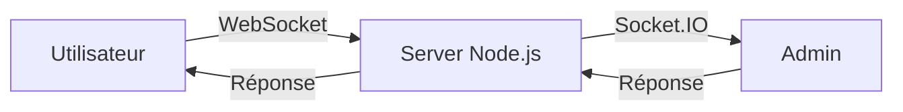

<div align="center">


# Brume

### Assistant IA simulé avec interface en temps réel

[](https://nodejs.org/)
[](https://expressjs.com/)
[](https://socket.io/)
[](LICENSE)

[🚀 Quick Start](QUICK-START.md) • [Démo](#-démo) • [Installation](#-installation-rapide) • [Fonctionnalités](#-fonctionnalités) • [Documentation](#-documentation)

</div>

---

## 📖 Description

**Brume** est une application web interactive qui simule une intelligence artificielle conversationnelle. Les utilisateurs peuvent poser des questions anonymement et recevoir des réponses en temps réel, fournies discrètement par des administrateurs humains via une interface dédiée.

Ce projet éducatif démontre les concepts fondamentaux du développement web moderne : communication temps réel avec WebSocket, architecture client-serveur, et gestion d'états distribués.

### 🎯 Cas d'usage

- **Pédagogique** : Apprendre Node.js, Express et Socket.IO
- **Prototype** : Tester un concept de chat avec support humain déguisé
- **Démonstration** : Illustrer les interactions temps réel dans une application web

---

## Documentation conceptuelle
Ce projet fait partie d’une réflexion plus large sur la programmation méta-déclarative et le développement AI-native.
La documentation complète se trouve dans [`/docs/Meta-Declarative-AI-Runtime`](docs/Meta-Declarative-AI-Runtime/).

> Point d’entrée : [Sommaire commun](docs/Meta-Declarative-AI-Runtime/sommaire-commun.md)

---

## 🤔 Choix du Langage

### Contexte de la décision

Lors de la conception de Brume, plusieurs technologies ont été évaluées pour créer une application de chat temps réel. Voici les alternatives considérées et les raisons de notre choix final.

### Technologies évaluées

#### 🟢 **Node.js + Express + Socket.IO** (Choix retenu)

**Avantages :**
- **Temps réel natif** : Socket.IO est la solution de référence pour WebSocket, avec gestion automatique des reconnexions et fallbacks
- **JavaScript partout** : Même langage côté client et serveur, idéal pour l'apprentissage
- **Écosystème riche** : npm offre des millions de packages
- **Performance** : Architecture événementielle non-bloquante, parfaite pour les I/O intensives
- **Communauté** : Documentation abondante, tutoriels, et support actif

**Inconvénients :**
- Peut sembler complexe pour les débutants absolus en programmation
- Gestion asynchrone nécessite une bonne compréhension des Promises/async-await

#### 🐍 **Python + Flask + Flask-SocketIO**

**Avantages :**
- **Syntaxe claire** : Python est réputé pour sa lisibilité, excellent pour l'éducation
- **Flask minimaliste** : Framework simple et rapide à prendre en main
- **Polyvalent** : Peut évoluer vers du machine learning ou data science

**Inconvénients :**
- Flask-SocketIO moins mature que Socket.IO (Node.js)
- Moins performant pour les connexions concurrentes (GIL Python)
- Deux langages à apprendre (Python backend, JavaScript frontend)

#### 🐘 **PHP + SSE/WebSocket**

**Avantages :**
- **Hébergement facile** : PHP disponible sur presque tous les hébergeurs
- **Courbe d'apprentissage douce** : Syntaxe accessible pour les débutants

**Inconvénients :**
- Moins adapté au temps réel (PHP est conçu pour requête-réponse)
- Nécessite des extensions ou bibliothèques tierces pour WebSocket
- Architecture moins moderne pour ce type d'application

### 🎯 Décision finale : Node.js + Express + Socket.IO

**Pourquoi ce choix ?**

1. **Excellence technique pour le temps réel** : Socket.IO est l'outil le plus robuste et éprouvé pour les applications de chat
2. **JavaScript full-stack** : Un seul langage à maîtriser réduit la charge cognitive pour les apprenants
3. **Industrie standard** : Ces technologies sont massivement utilisées en entreprise (Slack, Discord, Trello...)
4. **Évolutivité** : Le projet peut facilement évoluer vers des fonctionnalités avancées (notifications push, streaming, etc.)
5. **Ressources d'apprentissage** : Abondance de tutoriels, documentation, et communauté active

**Verdict :**
Pour un projet pédagogique axé sur le temps réel et la communication bidirectionnelle, Node.js + Socket.IO offre le meilleur compromis entre simplicité d'apprentissage, puissance technique, et pertinence professionnelle.

---

## 📐 Philosophie du Code

### Lisibilité avant optimisation

Brume est conçu comme un **projet pédagogique**. Les choix architecturaux privilégient la **clarté** et la **maintenabilité** plutôt que l'optimisation prématurée.

#### Principes appliqués

**1. Séparation des responsabilités**
- **HTML** : Structure sémantique uniquement
- **CSS** : Styles isolés dans `public/styles/`
- **JavaScript** : Logique métier séparée dans `public/scripts/`

Cette séparation permet de :
- ✅ Comprendre rapidement le rôle de chaque fichier
- ✅ Modifier les styles sans toucher à la logique
- ✅ Déboguer plus facilement en isolant les couches
- ✅ Enseigner les bonnes pratiques du développement web

**2. Code commenté et explicite**
- Noms de variables descriptifs (`sessionIdEl`, `typingEl`)
- Commentaires JSDoc pour les fonctions principales
- Logique linéaire et facile à suivre

**3. Pas de bundler ni de framework complexe**
- Pas de Webpack, Vite ou Babel (volontairement)
- Pas de framework frontend (React, Vue, Svelte...)
- JavaScript vanilla pour rester accessible aux débutants

**4. Architecture évolutive**
- Le code peut facilement être refactorisé vers TypeScript
- Les fichiers CSS peuvent être migrés vers SASS/LESS si souhaité
- La structure permet d'ajouter des modules sans tout casser

### 🎓 Pour les apprenants

Ce projet démontre qu'il est possible de créer une application fonctionnelle et moderne **sans tooling complexe**. Une fois les concepts maîtrisés, vous pourrez naturellement évoluer vers des architectures plus avancées (SSR, bundling, frameworks...).

**Conseil** : Lisez les fichiers dans cet ordre pour comprendre le projet :
1. `server.js` → Architecture backend
2. `public/user.html` + `public/scripts/user.js` → Interface utilisateur
3. `public/admin.html` + `public/scripts/admin.js` → Interface admin

---

## ✨ Fonctionnalités

### 👤 Interface Utilisateur

- 🎨 Design moderne inspiré de ChatGPT (thème sombre)
- 💬 Chat en temps réel avec sessions anonymes
- ⏳ Animation de "réflexion" pendant l'attente
- 📱 Interface responsive et optimisée mobile (iPhone, Android)
- 🆔 Identifiant de session unique généré automatiquement
- 🔄 Reconnexion automatique avec restauration de l'historique
- 💾 Conservation des conversations dans une base de données SQLite
- 🟢 Basé sur [Pico.css](https://picocss.com/) pour un rendu mobile élégant

### 👨‍💼 Interface Administrateur

- 📋 Liste des sessions utilisateur actives (panneau latéral gauche)
- 🔔 Notifications de nouveaux messages (badge "NEW")
- 💬 Vue complète de l'historique des conversations (panneau de chat à droite)
- ⚡ Réponse en temps réel avec envoi par Enter
- 🎯 Interface à deux panneaux pour gérer plusieurs utilisateurs simultanément

---

## 🚀 Installation Rapide

### Prérequis

- [Node.js](https://nodejs.org/) version 18 ou supérieure
- npm (inclus avec Node.js)

### Étapes d'installation

1. **Cloner le dépôt**
   ```bash
   git clone https://github.com/Stilmant/Brume.git
   cd Brume
   ```

2. **Installer les dépendances**
   ```bash
   npm install
   ```

3. **Lancer le serveur**
   ```bash
   npm start
   # ou directement : node server.js
   ```

4. **Accéder à l'application**
   - Interface utilisateur : [http://localhost:3000/user.html](http://localhost:3000/user.html)
   - Interface admin : [http://localhost:3000/admin.html](http://localhost:3000/admin.html)

Le serveur démarre sur le port **3000** par défaut.

### 🟢 Responsive & Mobile

L'interface utilise [Pico.css](https://picocss.com/) pour garantir un affichage optimal sur iPhone, Android et desktop.

- 📱 `<meta name='viewport'>` présent dans chaque HTML
- 📦 Pico.css chargé via CDN dans `user.html` et `admin.html`
- 🧪 Testé sur iPhone (Safari, Chrome) et Android
- 🎨 Composants adaptatifs (boutons, textarea, sidebar)

**Astuce** : Pour tester le rendu mobile, ouvrez l'interface dans Chrome DevTools (Ctrl+Shift+M) et sélectionnez un device iPhone.

---

### 🧪 Tester la base de données

```bash
npm test
# ou directement : node test-db.js
```

Ce script vérifie que la persistance SQLite fonctionne correctement.

---

## 🎬 Démo

### Interface Utilisateur
L'utilisateur converse avec "Brume" via une interface moderne et épurée.

```
┌─────────────────────────────────────────┐
│  🌫️ Brume          Session: abc123def  │
├─────────────────────────────────────────┤
│                                         │
│  [V] Bonjour Brume !                   │
│                                         │
│      [B] Bonjour ! Comment puis-je     │
│          vous aider aujourd'hui ?       │
│                                         │
│  [V] Quelle est la météo ?             │
│                                         │
│      [B] ● ● ●  (réflexion...)         │
│                                         │
├─────────────────────────────────────────┤
│ Envoyez un message à Brume...  [Envoyer]│
└─────────────────────────────────────────┘
```

### Interface Administrateur
Les admins voient toutes les sessions et peuvent répondre instantanément.

```
┌──────────────┬────────────────────────────┐
│ 🌫️ Brume     │ Conversation: abc123def    │
│ [ADMIN]      │                            │
├──────────────┤  [U] Bonjour Brume !       │
│ Sessions     │                            │
│              │      [B] Bonjour ! Comment │
│ ● abc123def  │          puis-je vous...   │
│   NEW        │                            │
│   2 messages │  [U] Quelle est la météo ? │
│              │                            │
│ ○ xyz789abc  │                            │
│   1 message  │                            │
│              ├────────────────────────────┤
│              │ Réponse... 🔹 [Envoyer]   │
└──────────────┴────────────────────────────┘
```

---

## 🏗️ Architecture

### Technologies

| Technologie | Version | Rôle |
|------------|---------|------|
| **Node.js** | 20+ | Runtime JavaScript côté serveur |
| **Express** | 5.1 | Framework web minimaliste |
| **Socket.IO** | 4.8 | Communication bidirectionnelle temps réel |
| **UUID** | 13.0 | Génération d'identifiants uniques |
| **Better-SQLite3** | 11+ | Base de données SQLite pour la persistance |

### Structure du projet

```
Brume/
├── public/
│   ├── styles/
│   │   ├── common.css     # Styles communs partagés
│   │   ├── user.css       # Styles spécifiques utilisateur
│   │   └── admin.css      # Styles spécifiques admin
│   ├── scripts/
│   │   ├── user.js        # Logique client utilisateur (avec reconnexion)
│   │   └── admin.js       # Logique client admin
│   ├── user.html          # Interface utilisateur (structure)
│   ├── admin.html         # Interface administrateur (structure)
│   └── brume-thought.svg  # Logo Brume
├── server.js              # Serveur Node.js + Socket.IO
├── db.js                  # Module de gestion SQLite
├── brume.db               # Base de données SQLite (générée automatiquement)
├── package.json           # Dépendances et configuration
└── README.md              # Documentation
```

### Flux de communication



1. L'utilisateur se connecte et reçoit un ID de session unique
2. Les messages sont transmis en temps réel via Socket.IO
3. L'admin reçoit une notification et peut répondre
4. La réponse est envoyée instantanément à l'utilisateur

---

## 📚 Documentation

### Fichiers principaux

#### `server.js`
Serveur Express avec gestion Socket.IO pour :
- Servir les fichiers statiques (`public/`)
- Gérer les connexions utilisateur/admin
- Router les messages entre sessions
- Stocker l'historique dans SQLite via `db.js`
- Gérer la reconnexion des utilisateurs avec leur ID de session

#### `db.js`
Module de gestion de la base de données SQLite :
- Création automatique des tables (sessions, messages)
- Fonctions CRUD pour les sessions et messages
- Gestion des sessions avec timestamps et statuts
- Nettoyage des sessions inactives

#### `public/user.html`
Structure HTML de l'interface utilisateur (minimaliste, charge les styles et scripts externes)

#### `public/admin.html`
Structure HTML de l'interface admin (minimaliste, charge les styles et scripts externes)

#### `public/styles/common.css`
Styles partagés entre les deux interfaces :
- Reset CSS et base commune
- Header et logo
- Avatars (utilisateur, AI, admin)
- Zone de chat et scrollbars
- Badges et boutons
- États vides

**Avantage** : Évite la duplication, facilite la maintenance et garantit une cohérence visuelle.

#### `public/styles/user.css`
Styles spécifiques à l'interface utilisateur :
- Thème sombre (#343541)
- Messages et bulles de chat
- Animation de réflexion (typing indicator)
- Zone de saisie et bouton d'envoi vert
- Écran d'accueil

#### `public/styles/admin.css`
Styles spécifiques à l'interface admin :
- Thème plus sombre (#1e1e1e)
- Sidebar pour liste des sessions
- Layout en deux colonnes
- Bulles de message alignées (user à gauche, admin à droite)
- Zone d'envoi avec bouton violet

#### `public/scripts/user.js`
Logique client utilisateur :
- Connexion Socket.IO avec gestion de reconnexion
- Stockage de l'ID de session dans localStorage
- Restauration automatique de l'historique après reconnexion
- Gestion des messages (envoi, réception, affichage)
- Animation de réflexion (typing indicator)
- Interactions utilisateur (formulaire, auto-scroll)

#### `public/scripts/admin.js`
Logique client admin :
- Affichage de la liste des sessions
- Sélection et affichage de l'historique
- Envoi de réponses en tant que Brume
- Gestion des raccourcis clavier (Enter pour envoyer)

### Configuration

Le serveur écoute sur le port `3000`. Pour changer le port :

```javascript
// Dans server.js, ligne finale
httpServer.listen(3000, () => {
  console.log("http://localhost:3000");
});
```

### 💾 Persistance des données

Brume utilise **SQLite** (via `better-sqlite3`) pour stocker :
- Les sessions utilisateur avec ID unique
- L'historique complet des conversations
- Les timestamps de création et dernière activité
- Le statut "non lu" pour les notifications admin

**Base de données** : `brume.db` (générée automatiquement au premier lancement)

**Avantages** :
- ✅ Pas besoin de serveur de base de données externe
- ✅ Persistance après redémarrage du serveur
- ✅ Performances excellentes pour des milliers de sessions
- ✅ Fichier unique facile à sauvegarder

> 💡 **Comment ça marche ?** Consultez [EXPLICATION-DB.md](EXPLICATION-DB.md) pour comprendre en détail quand et comment la base de données est créée.

### 🔄 Reconnexion automatique

Les utilisateurs sont automatiquement reconnectés à leur session :

1. **Première visite** : Un ID de session unique est généré et stocké dans `localStorage`
2. **Visites suivantes** : L'ID est envoyé au serveur qui restaure l'historique complet
3. **Changement de navigateur** : Nouvelle session (localStorage est local au navigateur)

**Indicateur visuel** : Le message `(reconnecté)` apparaît après l'ID de session.

**Nettoyage** : Les sessions inactives depuis 30+ jours peuvent être supprimées (fonction `cleanOldSessions()` dans `db.js`).

---

## 🔮 Améliorations Futures

- [x] 💾 Persistance des données avec SQLite/MongoDB
- [x] 🔄 Reconnexion automatique des utilisateurs
- [ ] 👥 Support multi-admin avec attribution de sessions
- [ ] 🔐 Authentification admin avec mots de passe
- [ ] 🧹 Nettoyage automatique périodique des vieilles sessions
- [ ] �️ Rate limiting et protection contre les abus
- [ ] �📊 Statistiques et analytics (temps de réponse, nombre de sessions)
- [ ] 🎨 Thèmes personnalisables (clair/sombre)
- [ ] 🌍 Internationalisation (i18n)
- [ ] 🤖 Intégration optionnelle d'une vraie IA (OpenAI API)
- [ ] 📱 Application mobile (React Native)

---

## ⚠️ Notes de Sécurité

### 🚨 Pour une utilisation en production

**Ce projet est conçu à des fins éducatives et de démonstration.** Pour un déploiement en production, implémentez les mesures de sécurité suivantes :

#### 1. Authentification Admin
- ⚠️ **Actuellement** : Aucune protection sur `/admin.html`
- ✅ **Recommandation** : Ajouter une authentification (Basic Auth, JWT, OAuth)
- 💡 **Solution rapide** : Utiliser une variable d'environnement comme secret partagé

```javascript
// Exemple simple dans server.js
app.use('/admin.html', (req, res, next) => {
  const auth = req.headers.authorization;
  if (auth === `Bearer ${process.env.ADMIN_SECRET}`) {
    next();
  } else {
    res.status(401).send('Unauthorized');
  }
});
```

#### 2. Rate Limiting
- ⚠️ **Actuellement** : Aucune limite sur les messages
- ✅ **Recommandation** : Implémenter `express-rate-limit` pour prévenir les abus
- 💡 **Package** : `npm install express-rate-limit`

#### 3. Validation des entrées
- ⚠️ **Actuellement** : Validation minimale (trim uniquement)
- ✅ **Recommandation** : Valider longueur, contenu, filtrer HTML/scripts
- 💡 **Package** : `express-validator` ou `joi`

#### 4. HTTPS en production
- ⚠️ **Actuellement** : HTTP seulement
- ✅ **Recommandation** : Utiliser HTTPS avec certificat SSL/TLS
- 💡 **Solution** : Reverse proxy (Nginx, Caddy) ou Cloudflare

#### 5. Variables d'environnement
- ⚠️ **Actuellement** : Port et config en dur
- ✅ **Recommandation** : Utiliser `.env` avec `dotenv`
- 💡 **Fichier** : `.env` avec `PORT`, `ADMIN_SECRET`, `DATABASE_PATH`

### ✅ Sécurité actuelle (OK pour démo)

- ✅ SQLite avec préparation des requêtes (prévention SQL injection)
- ✅ Validation de base des IDs de session
- ✅ Pas de stockage de données sensibles
- ✅ CORS géré par Socket.IO

---

## 🤝 Contribution

Les contributions sont les bienvenues ! N'hésitez pas à :

1. 🍴 Fork le projet
2. 🌿 Créer une branche (`git checkout -b feature/amelioration`)
3. 💾 Commit vos changements (`git commit -m 'Ajout de...'`)
4. 📤 Push vers la branche (`git push origin feature/amelioration`)
5. 🔀 Ouvrir une Pull Request

---

## 📝 Licence

Ce projet est sous licence **ISC** - libre d'utilisation pour l'apprentissage et la modification.

---

## 👨‍💻 Auteur

Créé avec ❤️ pour apprendre et enseigner les bases du développement web moderne avec Node.js.

**Projet pédagogique** - Parfait pour comprendre Socket.IO et les applications temps réel !

---

<div align="center">

**⭐ Si ce projet vous a aidé, n'hésitez pas à lui donner une étoile !**

[🐛 Signaler un bug](https://github.com/Stilmant/Brume/issues) • [💡 Suggérer une fonctionnalité](https://github.com/Stilmant/Brume/issues)

</div>